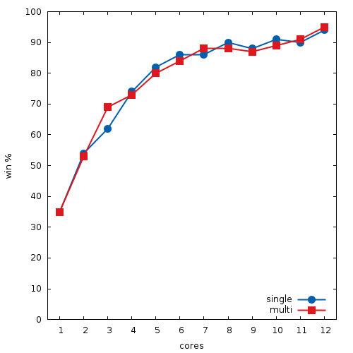

# lockfree-mcts-java [](https://travis-ci.org/lake4790k/lockfree-mcts-java)
General lockfree Monte Carlo Tree Search implementation in Java

### Results

Result from the included n x k TicTacToe game



```java -cp classes:test-classes mcts.BenchmarkMcts 8 6 200 400```

### References

[1] [A Lock-free Multithreaded Monte-Carlo Tree Search Algorithm](
https://webdocs.cs.ualberta.ca/~mmueller/ps/enzenberger-mueller-acg12.pdf)

[2] [Mastering the game of Go with deep neural networks and tree search](http://willamette.edu/~levenick/cs448/goNature.pdf)
